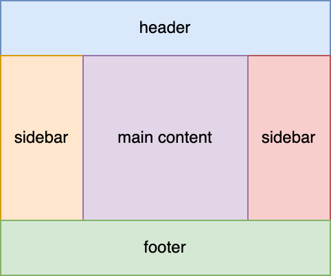
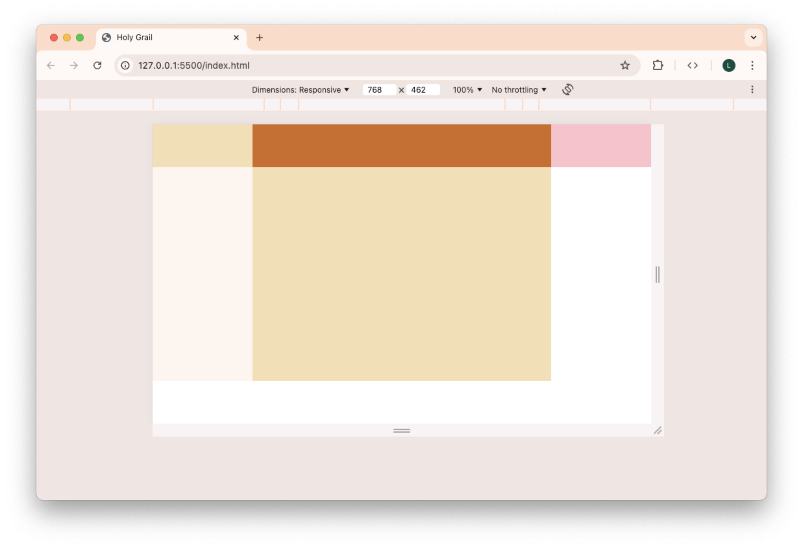
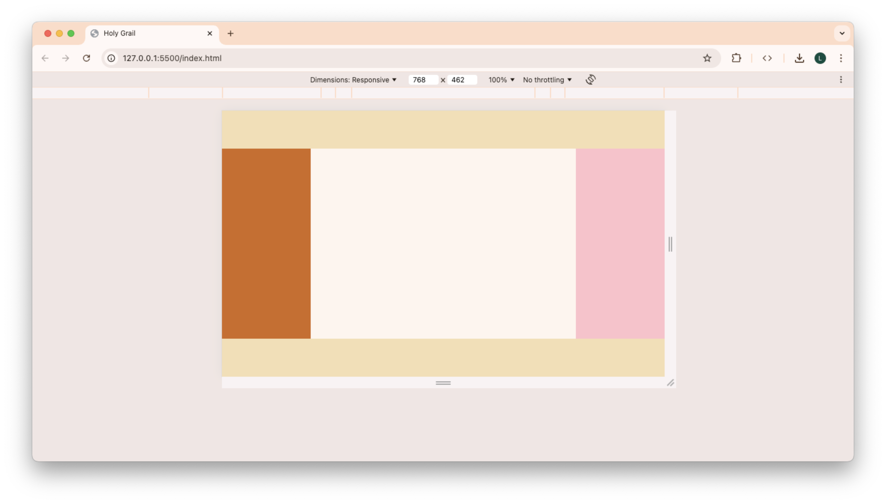

# Holy Grail

The **Holy Grail** is a website layout that consists of multiple columns sandwiched between a header and a footer. It was historically difficult to achieve, but modern tools such as CSS Grid have provided elegant solutions to this problem.



## Instructions

1. Each person in the group should clone this repository down to their local machine. This will not be submitted.
2. Open the cloned folder with VS Code.
3. Live serve `index.html` to see the starting point for this guided practice.
4. Choose one person in the group to share their screen.
5. Everyone else in the group should follow along and type the answers on their own computers.
6. As a team, read each question out loud and reach a consensus on the answer before moving to the next question.

## Start with a mobile grid

The page is blank! Let's fix that. We'll follow the **mobile-first design** principles to create a layout that works well with narrow screens.

1. Write CSS in `index.css` so that all elements with the `half` class have a `min-height` of `50vh` and all elements with the `full` class have a minimum height of `100vh`. Several differently-colored rectangles should now be rendered.
2. What are the direct children of `body` in the provided HTML?
3. Set `display` to `grid` for `body`. What changes?
4. How many rows and columns does `body` have?
5. By default, a grid container starts with how many columns?
6. By default, a grid container starts with how many rows?

## Adjust for wider screens

A one-column layout with very tall sections works great for narrow screens, but it's not the best for wider screens. We want the site to transition from the one-column layout to the Holy Grail layout when the viewport is wide enough. This follows the philosophy of **progressive enhancement**.

7. `@media (width <= 1200px)` is a **media query** that only applies when the viewport width is less than or equal to 1200px. What is the **media query** that would only apply when the viewport width is strictly greater than 320px?
8. Add an [`@media` rule](https://developer.mozilla.org/en-US/docs/Web/CSS/@media) to `index.css` for viewports that are at least as wide as 600px. Until otherwise specified, the rest of the CSS you write for this guided practice should go inside the body of this media query.
9. Set the `min-height` of `.half` and `.full` to [`initial`](https://developer.mozilla.org/en-US/docs/Web/CSS/initial). This will clear the styles that you wrote previously, but only when the media query is active.
10. Use a browser inspector to simulate different viewport sizes. What happens when the viewport width is narrower than 600px? What happens when the viewport width is wider than 600px?
11. Zero out the `margin` of `body` and set its `width` and `height` to 100% of the viewport size. How does this change the answers to the previous question?

## Build the holy grail layout

Since `body` is a **grid container**, we can define its **rows** and **columns**, which are called **grid tracks**. It will then automatically rearrange its _direct_ children, which are referred to as **grid items**, to fit into the **cells** created by these tracks.

12. `grid-template-columns: 20rem 30rem` creates two columns in the grid: one with width `20rem`, and another with width `30rem`. What would `grid-template-rows: 30vh 40vh 50vh` create?
13. Grid allows us to use a new relative length unit: `fr`. It represents a fraction of the available space in the grid container. `grid-template-columns: 1fr 1fr 1fr` creates 3 equal-width tracks. What declaration would create 4 equal-height rows?
14. What would `grid-template-columns: 1fr 3fr 1fr` create? Think about flex grow factors!
15. Style `body` so that it has 3 columns. The middle column should be 3 times as wide as the first and last columns, which are equal in width.
16. Style `body` so that it has 3 rows. The middle row should be 5 times as tall as the first and last rows, which are equal in height.



> [!TIP]
>
> Tired of writing `1fr` over and over again? What if your grid had 12 columns? You can use [`repeat`](https://developer.mozilla.org/en-US/docs/Web/CSS/repeat) instead!
>
> ```css
> grid-template-columns: repeat(12, 1fr);
> ```

> [!TIP]
>
> `grid-template` is shorthand for combining `grid-template-rows` and `grid-template-columns` into one property. These two rules are equivalent:
>
> ```css
> .grid {
>   grid-template-rows: 1fr 20ch;
>   grid-template-columns: 300px 4rem;
> }
>
> .grid {
>   grid-template: 1fr 20ch / 300px 4rem;
> }
> ```

## Place grid items into specific areas

We're almost done! The final step is to explicitly tell each grid item where in the grid to go, since the current auto-placement is not sufficient.

17. The 1st grid track is defined by the **grid lines** 1 and 2. The 2nd grid track is defined by the grid lines 2 and 3. Which grid lines would define the 15th grid track of a grid container?

> [!TIP]
>
> You can see these grid line numbers by using the browser inspector! For example, here is [the Firefox tutorial on using the CSS Grid Inspector](https://firefox-source-docs.mozilla.org/devtools-user/page_inspector/how_to/examine_grid_layouts/index.html).

18. Grid lines can also be counted from the back. The last track in a grid is defined by the grid lines -2 and -1. The second-to-last track in a grid is defined by the lines -3 and -2. Which _negative_ grid lines would define the 2nd track in a grid with 5 tracks?
19. `grid-column: 1 / 2` is applied to a grid _item_. This declaration tells the item to start at column line 1 and end at column line 2. Where would `grid-row: 2 / 4` place a grid item?
20. `grid-row: 1 / span 2` tells a grid item to start at row line 1 and _span_ two lines, ending at line 3. Where would `grid-column: 4 / span 1` place a grid item?
21. Write CSS so that both the `header` and the `footer` take up all 3 columns in the grid of `body`.
22. Write CSS so that `main` is placed in the middle wider column of the second row. You'll need to use `grid-row` as well!
23. How does grid auto-place a grid item if the row and column of that item are not explicitly specified by the CSS?
24. What are the advantages and disadvantages of rearranging elements in the HTML as opposed to moving them with CSS?



> [!TIP]
>
> `grid-area` is shorthand for combining `grid-row` and `grid-column` into one property. These two rules are equivalent:
>
> ```css
> .grid-item {
>   grid-row: 1 / 2;
>   grid-column: 3 / 4;
> }
>
> .grid-item {
>   grid-area: 1 / 3 / 2 / 4;
> }
> ```

> [!TIP]
>
> A tip for remembering which property to use where: plural properties (`columns` and `rows`) are applied to the grid _container_. Singular properties (`column` and `row`) are applied to the grid _item_ inside the grid container.
